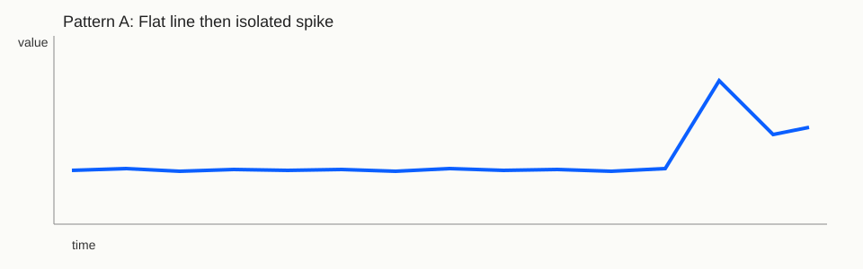
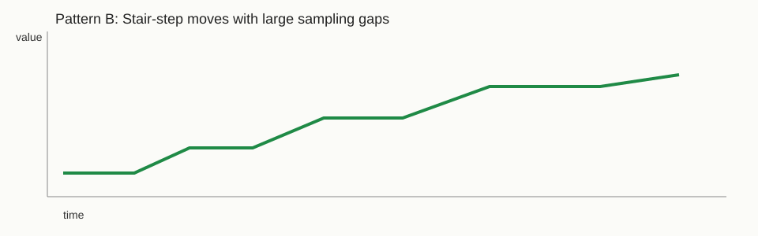
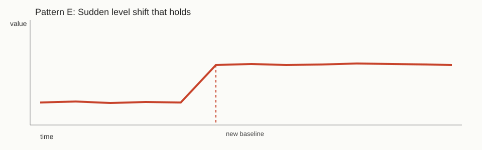

# OptionTrader Teaching Guide: Data, Metrics, Alerts, and Graph Patterns

This guide is a practical training document for understanding how OptionTrader turns option quotes into alerts, how to read graphs correctly, and how to recognize patterns that are signal-worthy versus data-quality artifacts.

Use this as a living playbook and add new case studies over time.

Companion HTML version (interactive navigation + glossary links):

- [Open the HTML playbook](optiontrader-pattern-playbook.html)

Trading curriculum (learning path for SPX option combos + tool usage):

- [Open SPX combo curriculum](spx-combo-trading-curriculum.md)
- [Open SPX combo curriculum (HTML)](spx-combo-trading-curriculum.html)

## Quick Navigation

- [1) Mental Model of the Tool](#1-mental-model-of-the-tool)
- [2) Core Concepts and Definitions](#2-core-concepts-and-definitions)
- [3) Reading Graphs Correctly](#3-reading-graphs-correctly)
- [4) Pattern Library](#4-pattern-library-what-you-see-vs-what-it-usually-means)
- [5) Alert-Specific Shape Heuristics](#5-alert-specific-shape-heuristics)
- [6) Data-Quality vs Market-Signal Decision Tree](#6-data-quality-vs-market-signal-decision-tree)
- [7) Practical Scenarios and Recommended Actions](#7-practical-scenarios-and-recommended-actions)
- [8) Build the Knowledge Base](#8-building-this-knowledge-base-over-time)
- [9) Reference Files](#9-reference-files)
- [10) Quick Checklist for Analysts](#10-quick-checklist-for-analysts)
- [Pattern Gallery (Illustrations)](#pattern-gallery-illustrations)
- [Screenshot Slots](#screenshot-slots)
- [Glossary](#glossary)

## 1) Mental Model of the Tool

OptionTrader runs in four layers:

1. **Ingest** (`IB` primary, `yfinance` fallback) captures snapshot quote data.
2. **Compute** reconstructs IV points and surface metrics per expiry bucket.
3. **Alerting** scores current values vs recent history (z-score + persistence + worst-case checks).
4. **UI/Review** visualizes metric history and alert details for decision-making.

When diagnosing weird chart shapes, always determine first if the issue is:

- **sampling/cadence**,
- **ingest coverage**, or
- a true **market regime move**.

## 2) Core Concepts and Definitions

### 2.1 Expiry Buckets

OptionTrader does not analyze every expiry individually. It groups available expirations into DTE buckets (default: 21D, 30D, 45D — configured in `config/config-v1.yaml` under `metrics.expiry_buckets_days`). For each bucket, the pipeline selects the closest real expiry in DTE space.

This bucketing is what makes the metrics time-comparable. Because bucket targets are fixed, the `rr25_30D` series you see in the Metric Explorer always refers to the "~30-day expiry" dimension, even as the actual contract rolls forward over time.

### 2.2 IV Points Used for Surface Construction

For each selected expiry, the pipeline solves implied vol at five delta points:

- `ATM` (50-delta, vol level)
- `+0.25C`, `-0.25P` (25-delta call and put — primary signal points)
- `+0.10C`, `-0.10P` (10-delta call and put — extreme tail points)

The 25-delta points are the main signal inputs. The 10-delta points provide additional tail context when coverage is sufficient (Full tier). If either ATM or 25-delta points are missing, the pipeline degrades or suppresses alerts for that bucket.

### 2.3 Metric Formulas (Mid and Worst)

At bucket level:

```
rr25_mid    = iv(+0.25C) − iv(−0.25P)          ← skew asymmetry
fly25_mid   = (iv(+0.25C) + iv(−0.25P))/2 − iv(ATM)   ← smile curvature
term_slope  = atm_iv(bucket_i) − atm_iv(bucket_j)     ← front vs back vol
```

**Mid** uses implied vols computed from option midpoints — theoretical, not tradeable.

**Worst-case** versions (`rr25_worst`, `fly25_worst`, `term_slope_worst`) recompute the same metrics using the *adverse* bid or ask IV for each leg — simulating what the metric would look like if every fill went against you. This is the execution reality check: if worst-case and mid agree, the signal is robust. If they diverge, the signal may exist only in the spread, not in the real market.

Why both metrics exist: option spreads on SPX wings can be wide enough to make a seemingly large RR25 dislocation disappear entirely once you account for realistic fill prices. The worst-case gate exists specifically to catch this.

### 2.4 Alert Logic

Alerts are generated in `src/core/alerts.py` and filtered further in `src/core/compute_snapshot.py`. An alert requires:

1. **Z-score gate**: `zscore_mid ≥ alerts.z_threshold` (default 2.0). The z-score is computed over a 60-day rolling window. This makes the threshold context-sensitive: the same absolute metric level can be extreme in a calm regime and unremarkable in a stress regime.
2. **Persistence gate**: the condition must hold on `≥ 2` consecutive snapshots (configurable). This eliminates single-snapshot spikes.
3. **Worst-case gate**: `zscore_worst` must also exceed threshold. This eliminates spread artifacts.
4. **Confidence tier**: requires sufficient IV point coverage (`Core` = ATM + 25Δ, `Full` = all five points).
5. **Tradability gate**: spread quality proxy must be acceptable.
6. **Regime gate**: certain alert types are suppressed in specific regimes (e.g., `RR_EXTREME` skew-fade signals are suppressed in Stress regime, because mean-reversion assumptions are unreliable when stress is accelerating).

Alert types:
- `RR_EXTREME` — skew dislocation (from `rr25_*`)
- `FLY_EXTREME` — smile convexity dislocation (from `fly25_*`)
- `TERM_KINK` — term structure dislocation (from `term_slope_*`)

## 3) Reading Graphs Correctly

The Metric Explorer supports two x-axis modes and gap-aware line segmentation:

- **Timeline**: actual timestamps.
- **Snapshot sequence**: evenly spaced index (`1..N`) to inspect pattern independent of wall-clock gaps.
- **Gap split**: line breaks when time gap exceeds configured threshold.

Also use the chart caption:

- `Points`
- `median gap`
- `max gap`

If `max gap` is large, visual shape can look misleading on timeline mode.

## Pattern Gallery (Illustrations)

These illustrations are synthetic shape guides, not direct exports from OptionTrader.

For real examples tied to actual snapshots, use:

- `docs/spx-curriculum/11-real-world-casebook.md`
- `docs/spx-curriculum/11-real-world-casebook.html`

- Flat then spike: `docs/assets/illustrations/pattern-flat-spike.svg`
- Stair-step with gaps: `docs/assets/illustrations/pattern-stair-gap.svg`
- Level shift and hold: `docs/assets/illustrations/pattern-level-shift.svg`



- Shape label: Pattern A (synthetic)
- Metric archetype: `rr25_mid` or `fly25_mid`
- Axes: x=`time`, y=`metric value`
- In-tool interpretation: confirm with `*_worst`, persistence, and data integrity gates



- Shape label: Pattern B (synthetic)
- Metric archetype: any (mostly cadence effect)
- Axes: x=`time`, y=`metric value`
- In-tool interpretation: compare Timeline vs Snapshot sequence and inspect `max gap`



- Shape label: Pattern E (synthetic)
- Metric archetype: `term_slope_mid` or persistent RR/FLY regime shift
- Axes: x=`time`, y=`metric value`
- In-tool interpretation: choose branch first (`reversion` / `continuation` / `no-trade`)

## 4) Pattern Library: What You See vs What It Usually Means

Use this section as your first triage map.

### Pattern A: Flat line then isolated spike

- **Typical shape**: long calm segment, one large jump, then partial reversion.
- **Primary interpretation**: event shock or outlier snapshot.
- **Checks**:
  - Compare Timeline vs Snapshot sequence.
  - Inspect `source` (IB vs yfinance) around the spike.
  - Confirm quote coverage and spread quality on that snapshot.
- **Alert risk**: high probability of `RR_EXTREME`/`FLY_EXTREME` if z-score window is short.

### Pattern B: Stair-step moves with big horizontal gaps

- **Typical shape**: plateaus connected by jumps.
- **Primary interpretation**: irregular sampling cadence, not continuous repricing.
- **Checks**:
  - Lower/raise gap-break threshold to expose segments.
  - Use Snapshot sequence mode to evaluate local continuity.
- **Alert risk**: medium; can inflate perceived persistence if runs are sparse.

### Pattern C: Smooth drift over many points

- **Typical shape**: gradual slope, low volatility around trend.
- **Primary interpretation**: regime transition or macro trend.
- **Checks**:
  - Validate move appears in both mid and worst metrics.
  - Check other buckets for coherent confirmation.
- **Alert risk**: moderate; more reliable when persistence passes naturally.

### Pattern D: High-frequency zig-zag around mean

- **Typical shape**: alternating up/down near zero drift.
- **Primary interpretation**: microstructure noise, often weak signal quality.
- **Checks**:
  - Inspect bid/ask spread quality and tradability score.
  - Require stronger persistence before acting.
- **Alert risk**: false-positive prone if threshold too low.

### Pattern E: Sudden level shift that stays elevated/depressed

- **Typical shape**: jump, then stable new baseline.
- **Primary interpretation**: repricing to new regime (higher confidence).
- **Checks**:
  - Confirm across nearby buckets.
  - Confirm worst-case metric agrees with mid.
- **Alert risk**: high and often actionable if tradability is acceptable.

### Pattern F: Missing bucket points / intermittent nulls

- **Typical shape**: sparse points or disappearing bucket lines.
- **Primary interpretation**: ingest/contract coverage issue.
- **Checks**:
  - `metrics_rows` per snapshot (expect full bucket set).
  - `iv_points` count and expiries count.
  - IB errors (`No security definition`, `Unknown contract`).
- **Alert risk**: unreliable; treat alerts cautiously until coverage is restored.

## 5) Alert-Specific Shape Heuristics

### 5.1 RR_EXTREME (Skew Dislocation)

Watch for:

- fast one-direction move in `rr25_mid` and `rr25_worst`
- persistence over required snapshots
- supportive move in related bucket(s)

Confidence increases when:

- `zscore_worst` is close to `zscore_mid`
- confidence tier is `Full`
- tradability score remains high

### 5.2 FLY_EXTREME (Smile Convexity Distortion)

Watch for:

- large excursions in `fly25_*` away from local baseline
- asymmetry with little ATM move can indicate wing-specific repricing

Confidence increases when:

- move is not a single-point spike only
- nearby expiries show related convexity stress

### 5.3 TERM_KINK (Term Structure Dislocation)

Watch for:

- abrupt sign flips or magnitude jumps in `term_slope_*`
- kink remains for multiple snapshots

Confidence increases when:

- slope change aligns with known event calendar or macro catalyst
- same direction appears in both mid and worst slope

## 6) Data-Quality vs Market-Signal Decision Tree

Use this in order:

1. **Cadence check**: are point gaps too large or highly irregular?
2. **Coverage check**: were expiries and bucket metrics complete?
3. **Source check**: did source switch (`IB` <-> `yfinance`) near the move?
4. **Quality check**: spreads and tradability healthy?
5. **Confirmation check**: mid and worst both agree?
6. **Persistence check**: threshold held for required snapshots?

If steps 1-3 fail, classify as **data artifact risk** first.

## 7) Practical Scenarios and Recommended Actions

### Scenario 1: “Charts look too straight/sparse”

- Likely cause: low ingest coverage and/or long timestamp gaps.
- Action:
  - verify `iv_points`, `metrics_rows`, expiry count in logs,
  - inspect IB contract-definition errors,
  - use Snapshot sequence mode before concluding metric bug.

### Scenario 2: “One dramatic alert after quiet period”

- Likely cause: event repricing or isolated outlier.
- Action:
  - compare mid vs worst z-score,
  - inspect surrounding snapshots and quote quality,
  - treat as provisional until one more confirming snapshot.

### Scenario 3: “Alert repeats but tradability is poor”

- Likely cause: statistically real but execution-fragile signal.
- Action:
  - keep as research signal,
  - block execution ideas or down-rank confidence,
  - monitor spread conditions for re-entry.

### Scenario 4: “After-hours run changes source unexpectedly”

- Likely cause: IB unavailability leading to fallback ingest.
- Action:
  - annotate source change,
  - avoid strict apples-to-apples comparison during transition,
  - continue monitoring if bucket coverage remains complete.

## 8) Building This Knowledge Base Over Time

Add one entry per notable event:

- date/time range
- source (`IB`/`yfinance`)
- affected metric + bucket
- observed shape
- whether alert fired
- root cause (market move / ingest issue / display artifact)
- final decision (actionable / monitor / ignore)

Suggested extension sections to add later:

- annotated chart screenshots per pattern
- empirical precision/recall by alert type
- per-regime threshold tuning notes
- post-trade outcomes by pattern class

## Screenshot Slots

Add real screenshots in this folder and keep file names stable:

- `docs/assets/screenshots/metric-explorer-timeline.png`
- `docs/assets/screenshots/metric-explorer-sequence.png`
- `docs/assets/screenshots/alert-detail-example.png`

When adding a screenshot, include:

- timestamp range
- metric + bucket
- source
- one-line interpretation

## 9) Reference Files

- Alert rules: `src/core/alerts.py`
- Snapshot compute and gates: `src/core/compute_snapshot.py`
- Metric formulas: `src/core/metrics.py`
- Metric Explorer UI: `src/app/streamlit_app.py`
- Main config: `config/config-v1.yaml`

## 10) Quick Checklist for Analysts

Before acting on an alert, confirm all are true:

- bucket data is complete and recent
- shape remains meaningful in Snapshot sequence mode
- `zscore_mid` and `zscore_worst` both pass threshold
- persistence requirement is met
- tradability score is acceptable
- regime filter does not invalidate the alert type

If any of the first two fail, classify as **watch-only** until data quality normalizes.

## Glossary

- **DTE**: Days to expiry.
- **ATM**: At-the-money implied volatility point (50-delta). Measures vol *level*, not shape.
- **RR25**: 25-delta risk reversal = `IV(+0.25C) − IV(−0.25P)`. Measures skew *asymmetry*. Negative in SPX (puts structurally more expensive than calls due to hedging demand). The interesting signal is not the absolute level but how extreme it is relative to its own recent history.
- **FLY25**: 25-delta butterfly proxy = `(IV(+0.25C) + IV(−0.25P))/2 − IV(ATM)`. Measures smile *curvature* — how elevated both wings are relative to the center. Separable from RR25: you can have high FLY (both wings elevated) with neutral RR (symmetric), or extreme RR (asymmetric) with low FLY.
- **Term Slope**: ATM IV difference across neighboring expiry buckets. Positive = front vol > back vol (event premium or stress). A *kink* (non-monotone local distortion) is more signal-relevant than a steady slope.
- **Mid**: Metric computed from option midpoints — theoretical, not tradeable.
- **Worst**: Same metric computed using adverse bid/ask fills for every leg — the execution reality check. Mid and worst agreeing is a signal robustness condition.
- **Z-score**: How many standard deviations the current metric value is from its 60-day rolling mean. Context-sensitive threshold: same absolute level can be extreme or ordinary depending on recent regime.
- **Persistence**: The alert has held above threshold on ≥ 2 consecutive snapshots. Eliminates single-point spikes.
- **Tradability Score**: `1 − min(1, median_spread / spread_gate_pct)`. Near 1.0 = tight spreads (good execution). Near 0.0 = wide spreads (edge likely consumed by friction). Computed in `src/core/tradability.py`.
